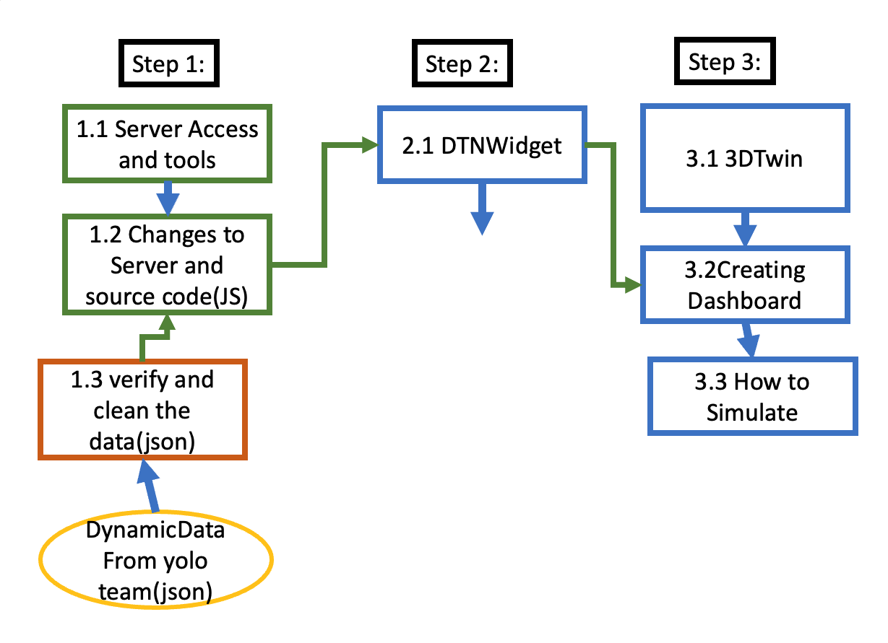

# **Project Digital Twin Nibelungenplatz (v4)**

[[_TOC_]]

# **Architecture**


# **Video Recording**

## Pre-production

### Objectives

1. Distinguish the requirements and objectives of the video.
2. Select the equipments needed
3. Locate the best video capturing locations

### Requirements

3 sets, each set have 5 video clips at the same time.

Video length should be at least 15 minutes

Configuration:

1. 1 set: Resolution 480X480 || FR : 25
2. 2 set: Resolution 1080 X 1080 || FR : 25
3. 3 set: Resolution 1080 X 1080 || FR : 20
4. Video recording clips from 5 different angles
5. Pedestrians and bicycle should be included in video frame

### Equipments

**Hardware:**

1. 5 cameras (3 iphone - 7, iphone - 11 and iphone  - 12 )
2. 4 tripods on street level and 1 to fix the video on top of the building 9
3. 1 ipad for remote controller 
4. Power banks (2)

**Software:** 

1. [MoviePro - Pro Video Camera](https://apps.apple.com/us/app/moviepro-pro-video-camera/id547101144)
2. [MoviePro Remote](https://apps.apple.com/us/app/moviepro-remote/id1195616020)

**Cloud Storage:**

1. Magenta Cloud - https://magentacloud.de/s/8eqxd7YCeomRsQB?path=%2FSummer%202023

## Production

### Testing

Firstly the video recording team had a basic testing on field video capture activity. There was used one camera and one tripod to fix  locations. During this phase there were identified locations and possible issues which the team should handle during the video capturing activity. At the end, trial videos for positioning were provided.

### Video Capturing

**Location:**

- The locations were determining during the Testing step by taking trial-videos on different days and from different locations. At the end, five locations as given to the image below were selected to cover the central area of the Nibelungenplatz.


**Camera Operation:**

- Set up and operate video cameras, ensuring proper exposure, focus, and framing for each shot.
- Adjust camera settings

**Lighting:**

- Choose the best lighting period time of the day (no rain, no wind and no clouds) to enhance the visual quality

**Sound:**

- No sound is required for the recordings.

**Equipment and Maintenance:**

- Maintain and organize video equipment, including cameras, tripods, ipad, power banks, phone holders.
- Ensure that all equipmenta are in good working condition.

## Post-Production

- Provide the recorded footage, following any specific guideline or requirement.
- Review and select the best shots.

# **Trimming Videos**

## Pre-trimming

### Objectives

1. Watch the videos taken from all cameras
2. Check for anomalies and identify their timestamp
3. Find the synchronisation among all videos 
4. Trim videos form 5 cameras

### Requirements

1. Chose the best starting timestamp 
2. Synchronize the videos with each other
3. Trim videos with different resolution and frame rate according to their recording properties.

### Equipments

**Hardware:**

1. Laptop  /  Desktop PC

**Software:** 

1. Adobe Premiere Pro 

**Cloud Storage:**

1. Magenta Cloud - https://magentacloud.de/s/4pKpf95o5PJntEM?path=%2F

## Trimming

After a detailed analysis of the videos from Set 1, Set 2 and Set 3, we trimmed the videos from Set 2 on different time lengths i.e 8 min,5 min, 3 min and 30 sec. Set 2 was chosen according to the resolution and frame rate. These features helped the YOLO team with the object detection analysis to proceed more accuracy and efficiency.

We have checked the starting point of each video and we identified the time elapse.
| Camera  | Starting time    |Max delayed time |Difference|
| ------- | -----------------|---------------- | -------- |
| Camera 1|10:57:37 |10:59:15|00:01:38|
| Camera 2|10:57:54 |10:59:15|00:01:21|
| Camera 3|10:58:13 |10:59:15|00:01:02|
| Camera 4|10:57:20|10:59:15|00:01:55|
| Camera 5|10:59:15 |10:59:15|00:00:00|

As given at the table above there are some time elapses between the cameras. Eventhough we tried to find the starting point using the timestamps it was not possible so we did it manually by find a vehicle that was shown on all cameras and taking it as a starting moment. At the figure below we have used different colors (red, green, blue) to represent the vehicles taken as reference.


We have chosen as a software to do our trimming Adobe Premiere Pro since it is a professional video editing software for creating complex projects with advanced editing, effects, and post-production features. Again it is not giving the possibility of videos automatically. 

To trim the videos using Adobe Premiere Pro we followed the following steps:

1. *Import the video:* "File" > "Import”
2. *Create a new sequence:* Right-click in the Project panel and choose "New Sequence.”
3. *Add the video to the timeline:* Drag and drop the video clip from the Project panel onto the timeline in the sequence.
4. *Set the work area:* Move the playhead (the red vertical line) to the desired starting point of the trim. Press the "I" key on your keyboard to set the in-point. Then, move the playhead to the desired ending point of the trim and press the "O" key to set the out-point.
5. *Trim the video:* removing the portions you don't want and keeping the desired sections.


As we can select and then use the delete button from the keyboard to remove the unwanted parts.

6. *Export the trimmed video:* "File" > "Export" >"Media”

## Post-trimming

1. Provide the trimmed sequences of videos, following any specific guideline or requirement like frame rate and resolution.
2. Provide three different video duration: 8 min, 5 min, 3 min and 30 sec with frame rate 25 and resolution 1080 x 1080
3. Upload the trimmed videos onto the cloud storage with the proper label.

***Note:*** 

Set 1 videos were not used due to their low resolution (480 x 480)

Set 3 videos could not be used due to anomalies occuring frequently (tree leaf was in front of a camera)

Magenta Cloud was almost full so we were not able to upload the videos from the beginning. A new magenta cloud was provided from Professor
# **Merging Videos**

## Pre-Merge

### Objectives

1. Merge on a single video all five video stream
2. Resolution of the video should fit the GDPR 

### Requirements

1. Videos should be processed by YOLO team
2. Length of videos should be the same

### Equipment

**Hardware:**

- Laptop

**Software:**

- Adobe Premiere Pro

**Cloud Storage:**

- Magenta Cloud - https://magentacloud.de/s/4pKpf95o5PJntEM?path=%2Fvideo_recordings%2FSS23

## Merge

To achieve the merging of our video clips we need to follow the given steps:

1. Utilize Adobe Premiere Pro to merge the video clips.
2. Insert a new Sequence with the frame size 1080 x 1080 and aspect ratio 1:1 which is similar as our recorded video clips
3. Check once again the resolution of the video clips all of them should have the same resolution
4. Import video clips on our timeline and stack the video clips on top of each other by dragging and dropping on the available video tracks.
5. Make sure the video clips are with the same duration length
6. Check video resolution and fix if needed *Right Click on the video clip* -> *Scale to Frame Size*

Since we have 5 video clips we need to divide the screen into 5 parts. The most important part is o find the anchor position. For each camera it is calculated as given into the image below


The final output is as shown below:


## Post-Merge

1. One video with all  5 video clips in one screen
2. Upload it to Magenta Cloud with the proper labeling
3. We have processed 3 merged videos: 1 final results from YOLO, 1 merged videos for all vehicles and 1 merged video only cars. 

***Notes:***

Since the video clips’s resolution were changed by YOLO team we had to use a 100% scale to fit them properly to our frame size (1080 x1080)


# **YOLO or YOLOv7**

YOLO is an advanced family of object detection architectures and models. The ability to identify objects in a single pass over an input image is the essential concept of YOLO, making it incredibly quick and effective. In contrast to conventional object identification techniques, which include several phases, YOLO instantly predicts bounding boxes and class probabilities for numerous objects.

### Overview and Workflow

<p style="text-align:center">
  
</p>
<p style="text-align:center">Figure: Workflow of YOLO section.</p>

### Object Detection using YOLOv7

**Description**

The version of the YOLO object detection model that will be utilized in this project are **YOLOv7** and **SORT**. It is an improved model that builds on YOLOv4.

YOLO (You Only Look Once) is a family of object detection architectures and models. The detections generated by **YOLOv7** are passed to SORT. SORT is a simple implementation of a visual system that tracks multiple objects, which is useful for later trajectory computation in this project. SORT can track any object that the **YOLOv7** model has been trained to detect.

| Input                                                                                                                                                                                | Output                                                                                                                                                                                            |
| ------------------------------------------------------------------------------------------------------------------------------------------------------------------------------------ | ------------------------------------------------------------------------------------------------------------------------------------------------------------------------------------------------- |
| `Video Data`, which are stored in MagentaCLOUD under the folder [`video_recordings`](https://magentacloud.de/s/4pKpf95o5PJntEM?path=%2Fvideo_recordings%2FSS23%2FtrimVideo%2F5mins). | Timestamped `2D Bounding Boxes` in JSON format, which are stored in MagentaCLOUD under the folder [`yolo_v7_output`](https://magentacloud.de/s/4pKpf95o5PJntEM?path=%2Fyolo_v7%2F5MinOutputJson). |

> **NOTE:**
>
> - In version 4, YOLOv7 + SORT is used. We used 2D boxes as version 3 with YOLO latest version. In combination with SORT it offers the possibility of object tracking and thus an advantage for the later trajectory computation.

**Step-by-Step**

For more information about the source code and the use of **YOLOv7** with **SORT** in this project (setup, execution, output, known bugs), see [YOLOv7 README](yolov7/README.md).

### Data Filtering

This script's purpose is to filter particular elements out of a JSON file that contains camera data. The script's main objective is to extract information about a certain type from the input file. The input JSON file is successfully read, the filtering method is used, and then the filtered data is written to a new JSON file.

**Functionality**

- **Input JSON File:** The script takes an input JSON file that contains camera data with various entries.
- **Filtering Criterion:** Based on a predetermined type, the script separates the pertinent entries from the supplied JSON data.
- **Data Extraction:** The script examines the JSON input and extracts just those entries that correspond to the designated type.
- **Filtered Data Output:** After filtering, the script writes the extracted entries, which pertain to the specified type, into a new JSON file.

Using this script, it is possible to effectively extract particular data types from large JSON files that contain camera data. Users can quickly concentrate on and examine specific types of information in the camera stream by using the filtering criterion that is provided. The filtered data is included in the output JSON file, enabling additional analysis and visualization of the relevant camera records.

> **NOTE:**
>
> - We will skip this step if we think we don't need to filter the data from the initial object detection.

**_Filterd Data_**

| Type                    | Link                                                                                                  |
| ----------------------- | ----------------------------------------------------------------------------------------------------- |
| Car                     | [Link](https://magentacloud.de/s/4pKpf95o5PJntEM?path=%2Fdata_filter%2FSS23%2Fcar)                    |
| Person                  | [Link](https://magentacloud.de/s/4pKpf95o5PJntEM?path=%2Fdata_filter%2FSS23%2Fperson)                 |
| Bicycle                 | [Link](https://magentacloud.de/s/4pKpf95o5PJntEM?path=%2Fdata_filter%2FSS23%2Fbicycle)                |
| Car and Bicycle         | [Link](https://magentacloud.de/s/4pKpf95o5PJntEM?path=%2Fdata_filter%2FSS23%2Fcar_and_bicycle)        |
| Car and Person          | [Link](https://magentacloud.de/s/4pKpf95o5PJntEM?path=%2Fdata_filter%2FSS23%2Fcar_and_person)         |
| Car, Bicycle and Person | [Link](https://magentacloud.de/s/4pKpf95o5PJntEM?path=%2Fdata_filter%2FSS23%2Fcar_bicycle_and_person) |

### Transform Coordinates

**Description**

This phase involves converting the 2D Bounding Boxes (2DBB) obtained from the Step [Detect Objects](#1-detect-objects) into EPSG-3857 Geo-Coordinates, which explains the folder name `bb_transformation`. This transformation is achieved by initially calculating the pixel coordinates of the detected vehicles' centroids using the 2DBB's pixel coordinates. Subsequently, these pixel coordinates are converted into EPSG-3857 Geo-Coordinates, relying on predefined reference points to perform the transformation.

Through the use of geometric computations and projection, pixel coordinates are converted to EPSG-3857 Geo-Coordinates. The crucial component in this procedure is the transformation matrix that is created from the reference points. This transformation allows us to precisely geolocate the detected vehicles, enabling various geographic applications like geospatial analysis and visualization and allowing us to examine their positions in context to the real world.

| Input                                                                                                                                                                                                               | Output                                                                                                                                                                                             |
| ------------------------------------------------------------------------------------------------------------------------------------------------------------------------------------------------------------------- | -------------------------------------------------------------------------------------------------------------------------------------------------------------------------------------------------- |
| Timestamped `2D Bounding Boxes` in JSON format, which are stored in MagentaCLOUD under the folder [`bb_transformation_input`](https://magentacloud.de/s/4pKpf95o5PJntEM?path=%2Fbb_transformation%2FSS23%2Finputs). | EPSG-3857 `Geo-Coordinates`, which are stored in MagentaCLOUD under the folder [`bb_transformation_output`](https://magentacloud.de/s/4pKpf95o5PJntEM?path=%2Fbb_transformation%2FSS23%2Foutputs). |

**Step-by-Step**

| Step | Description                                              |
| ---- | -------------------------------------------------------- |
| 1    | Extract reference points from Video Data                 |
| 2    | Transform pixel coordinates to EPSG-3857 Geo-coordinates |

**Step 1: Extract reference points from Video Data**

In order to convert pixel coordinates into EPSG-3857 Geo-Coordinates, a transformation matrix is utilized. This matrix is created using four reference points, which serve as fixed and easily recognizable locations in both the Video Data and Google Maps Satellite View. The image below illustrates these four reference points for each camera used in project DTN4.


<p>Figure: Extract reference points from Video Data.</p>

There are two ways to extract reference points from Video Data:

1. By using QGIS: See [Transformation.md](../bb_transformation/Transformation.md) for detailed instructions.
2. By using Paint (Windows) and Google Maps:

   - Take a screenshot of the video data and then resize it using Paint to match the video data's resolution, such as 1080x1080.
   - On the resized screenshot, place the mouse pointer over the relevant reference point. On Paint's bottom left corner, the pixel coordinates of the chosen reference point are shown.
   - Look for the selected reference point in Google Maps Satellite View. Click on it to get its EPSG-4326 Geo-Coordinates. Convert these coordinates to EPSG-3857 Geo-Coordinates by using [the Transform feature of epsg.io](https://epsg.io/transform#s_srs=4326&t_srs=3857&x=NaN&y=NaN).

The extracted reference points are stored in the file [ref_points.csv](../bb_transformation/ref_points/ref_points.csv).

**Step 2: Transform pixel coordinates to EPSG-3857 Geo-coordinates**

For more information about the implementation of this step, see [BB-Transformation README](../bb_transformation/README.md).

### Remove Outliers

This script processes a GeoJSON file containing location data from a camera feed. Its main objective is to remove data points that are outside of a certain bounding box. The filtered data is then saved to a new GeoJSON file. Some cameras are detecting faraway objects; for example, Building 9's cameras have a lot of outliers, which leads to inconsistent output. In such cases, we remove these outliers.

The simulation model operates within the Dassault platform, which features a defined boundary box. Regrettably, some cameras within this platform are detecting distant objects, which are classified as outliers. This situation leads to irregularities in the output. In such instances, it becomes necessary for us to take action and exclude these detected objects. For instance, consider the provided image, where Car No. 1891's x-coordinate is 967888.6439812179 and its y-coordinate is 6468900.796258357. The boundary box is described as follows: {'xmin': 967596.583700508, 'xmax': 967803.7492728742, 'ymin': 6468558.8948148275, 'ymax': 6468728.366299554}. Clearly, the coordinates of Car No. 1891 fall outside this defined boundary, necessitating the removal of this object from our analysis.


<p>Figure: Detecting Outliers.</p>

| Input                                                                                                                                                                                 | Output                                                                                                                                                                                                                                     |
| ------------------------------------------------------------------------------------------------------------------------------------------------------------------------------------- | ------------------------------------------------------------------------------------------------------------------------------------------------------------------------------------------------------------------------------------------ |
| `Input Data`, which are stored in MagentaCLOUD under the folder [`eliminateOutliers_SS23_input`](https://magentacloud.de/s/4pKpf95o5PJntEM?path=%2FeliminateOutliers%2FSS23%2Finput). | Output of eliminate outliers `eliminateOutliers` in JSON format, which are stored in MagentaCLOUD under the folder [`eliminateOutliers_SS23_output`](https://magentacloud.de/s/4pKpf95o5PJntEM?path=%2FeliminateOutliers%2FSS23%2Foutput). |

**How It Works**

**_**Define Boundaries**_** First of all, we draw box boundaries.

- xmin: 967596.583700508
- xmax: 967803.7492728742
- ymin: 6468558.8948148275
- ymax: 6468728.366299554

**_**Coordinate Filtering:**_**

- we iterate over the array and check if any coordinates do not fall within the boundaries
- Extract coordinates, IDs, and types for each object.

**_**Coordinate Validation:**_**

- Check if each coordinate falls within the specified box boundaries.
- If a coordinate is within the box, keep it and its corresponding ID and type.

[**More specification**](../EliminateOutliers)

### Clean Data

Maintaining consistency with object detection might be difficult in some circumstances. Consider a scenario in which a car suddenly appears from one edge of the area, leading YOLO to identify the car. An unanticipated tree suddenly blocks the car's view as it travels, which is a sudden development. Then, YOLO generates a new identifier for the car when it reemerges after some time. This effect may produce erroneous results, such as a car appearing suddenly in the middle of the road in the visual representation.


<p>Figure: Identifying and Filtering Out Data Below Minimum Threshold.</p>

Illustratively, let's examine Camera 4's scenario: At a specific juncture, a red car is assigned the identification number 6. However, after a span of 12 frames, an unexpected obstacle—a tree—comes into view, diverting attention from the car and leading to a temporary loss of focus. The car then returns to the scene, but this time it has a new identification number. 15 frames in a row make up the brief continuation of this sequence before the car disappears from view once more.

Even if it seems complete, keeping this data could unintentionally introduce inconsistencies during simulation. These inconsistencies could seem like sudden jumps or discontinuities, which might affect the accuracy of the visual representation. To reduce this, it was wisely decided to leave the information about this specific car out of the JSON file. This comprehensive approach makes sure that the visualization is more seamless and coherent, improving the overall output of the simulation in terms of realism.

| Input                                                                                                                                                                     | Output                                                                                                                                                                                                                              |
| ------------------------------------------------------------------------------------------------------------------------------------------------------------------------- | ----------------------------------------------------------------------------------------------------------------------------------------------------------------------------------------------------------------------------------- |
| `Input Data`, which are stored in MagentaCLOUD under the folder [`clean_data_SS23_inputs`](https://magentacloud.de/s/4pKpf95o5PJntEM?path=%2Fclean_data%2FSS23%2Finputs). | Output of clean data `clean_data_SS23_outputs` in JSON format, which are stored in MagentaCLOUD under the folder [`eliminateOutliers_SS23_outputs`](https://magentacloud.de/s/4pKpf95o5PJntEM?path=%2Fclean_data%2FSS23%2Foutputs). |

**How It Works**

We have applied a method based on object persistence to reduce the problem of object inconsistency and enhance trajectory identification. The steps in the procedure are as follows:

- **Threshold Establishment:** A 2-second threshold is chosen as the initial value.
- **Consecutive Persistence Value:** With a frame rate of 25 frames per second, the value for threshold_count is computed to be 2 seconds, or 50 frames.
- **Coordinate Evaluation:** A thorough analysis is done for each set of coordinates. These coordinates are regarded as sturdy and preserved if they hold steady throughout the course of 50 frames. In contrast, if the coordinates do not satisfy this persistence requirement, they are progressively eliminated from consideration together with the associated identification and object type.

[**More specification**](../cleanData)

## Merge Data

In the merge data, combine two pieces of JSON data from various camera feeds based on how close they are to one another spatially. The objective is to locate and combine data points from the second set that correspond to items found in the first set and are closer than a predetermined threshold. After merging the data, a new JSON file is created and stored.

**Algorithms**

- **Calculate Distance Function:** Calculate the Euclidean distance between two 3D coordinates using the `calculate_distance()` method.


<p>Figure: Camera 1 and Camera 2 coordinates.</p>

In the above figure, we have 2 car’s position from Cam1 and Cam2

- **Cam1:** (x1,y1,z1) = (967731.7601707891, 6468644.113205706, 1.0)
- **Cam2:** (x2,y2,z2) =(967729.0292636614, 6468641.806650725, 1.0)

**Plugging these values into the formula:**

distance = √((x1 - x2)^2 + (y1 - y2)^2 + (z1-z2)^2)

**Threshold distance of these 2 positions:**

Threshold_distance ≈ 3.5736060987


<p>Figure: Camera 3 and Camera 4 coordinates.</p>

In the provided illustration, the positions of two cars are captured by Cam1 and Cam4. When we compute the threshold distance between these positions, the value is determined to be 19.8010500065 units. Enhancing the accuracy of data transformation, by obtaining precise points from Google Maps during the transformation process, could potentially reduce this threshold distance. However, due to potential challenges in acquiring precise points from Google Maps, an alternative approach is taken.

We opt to merge the data from the two JSON sources, Cam1 and Cam4, using a fixed threshold distance of 20 meters. This merging process facilitates the identification of matched positions within this predefined distance. It's important to note that if more accurate points are attainable, this threshold distance can be decreased, resulting in a more refined merging process and subsequently yielding more accurate merged data.

| Input                                                                                                                                                                   | Output                                                                                                                                                                                                                            |
| ----------------------------------------------------------------------------------------------------------------------------------------------------------------------- | --------------------------------------------------------------------------------------------------------------------------------------------------------------------------------------------------------------------------------- |
| `Input Data`, which are stored in MagentaCLOUD under the folder [`merge_data_SS23_input`](https://magentacloud.de/s/4pKpf95o5PJntEM?path=%2Fmerge_data%2FSS23%2Finput). | Output of merge data `merge_data_SS23_output` in JSON format, which are stored in MagentaCLOUD under the folder [`merge_data_SS23_outputs`](https://magentacloud.de/s/4pKpf95o5PJntEM?path=%2Fmerge_data%2FSS23%2Foutput). |

**Merging Data Function**

Two pieces of JSON data (json_data1 and `json_data2`), a distance threshold, and an ID adjustment value (make sure to change the value every time when you merge 2 json files for getting unique id) are passed to the`merge_json_data()` method. In order to create a new dataset (`merged_data`), it analyzes the data to find matching items.

- **Iterations 1:** run the Cam1 as input and Cam2 as output json using adjust_ID = 10000
- **Iterations 2:** run OutputCam12 as input and Cam3 as output json using adjust_ID = 20000
- **Iterations 3:** run OutputCam123 as input and Cam4 as output json using adjust_ID = 30000
- **Iterations 4:** run OutputCam1234 as input and Cam45 as output json using adjust_ID = 40000

When comparing objects from `json_data1` and `json_data2` for potential merging, the function checks two conditions:

1. It ensures that an object from `json_data2` hasn't been matched with any object from `json_data1` yet. This prevents one object from `json_data2` being merged with multiple objects from `json_data1`

2. It checks if the types of objects in `json_data1` and `json_data2` are the same. Only objects with matching types are considered for merging.

**Merging and Saving Function**

Two input files (`json_file1` and `json_file2`) are read by the`merge_and_save_json()` method to read JSON data. The merged data is then saved to an output file after the program iterates through each pair of data entries and uses the `merge_json_data()` function to combine them.

[**More specification**](../MergeAllCameras)

### Calculate Orientation

**Description**

Based on the Geo-Coordinates received from merged data, the orientation of moving vehicles can be calculated. The orientation serves to make the movement of the vehicles on the Dassault platform smoother.

> **NOTE:**
>
> - In the previous winter of 2022, orientation was introduced exclusively for car.
> - In addition to car, we have also introduced orientation features for pedestrians and bicycles.
> - We have tried to improve the existing orientation algorithm. We did implement two new algorithms, however, it seems the previous algorithm produced more accurate results than ours. So we retain the previous algorithm.

| Input                                                                                                                                                                                      | Output                                                                                                                                                                                            |
| ------------------------------------------------------------------------------------------------------------------------------------------------------------------------------------------ | ------------------------------------------------------------------------------------------------------------------------------------------------------------------------------------------------- |
| EPSG-3857 `Geo-Coordinates`, which are stored in MagentaCLOUD under the folder [`merge_data_SS23_output`](https://magentacloud.de/s/4pKpf95o5PJntEM?path=%2Fmerge_data%2FSS23%2Foutput). | `Geo-Coordinates & Orientation`, which are stored in MagentaCLOUD under the folder [`calc_orientation_output`](https://magentacloud.de/s/4pKpf95o5PJntEM?path=%2Fcalc_orientation_output%2FSS23). |

**Car orientation**


<p>Figure: Car orientation.</p>

**Pedestrian orientation**


<p>Figure: Pedestrian orientation.</p>

**Bicycle orientation**


<p>Figure: Bicycle orientation.</p>

**How car orientation works:**

The orientation of a vehicle must be provided in the following notation: [x, y, z]. Each parameter represents the rotation of the vehicle around the x, y or z-axis. In our case the map is flat, so we are only interested in the z-axis rotation and must provide the orientation like this: [0, 0, α\alphaα]. α\alphaα is the parameter which must be calculated and represents the angle between north and the backside of the car.


**How pedestrians & bicycles orientation works:**

The goal is to calculate the movement angle of a person using camera detections. Assuming movement occurs mainly along the X-axis, a constant value of [-1.5, 0, 0] is employed. This value represents an orientation change for detected features like 'PERSON' or 'BICYCLE'. This simplifies movement angle calculation, although it's a basic representation compared to real-world movement complexity. The constant [X, Y, Z] = [-1.5, 0, 0] serves to simulate movement along the X-axis.


#### First Approach

**Velocity Calculation:**

The formula for calculating velocity in the x and y directions is derived from the basic physics equation for velocity: velocity = distance / time.
In this case, the code calculates the change in x and y coordinates (dx, dy) between two points and divides them by the time difference to get the velocities (vx, vy).

**Orientation Calculation:**

The orientation angle (alpha) is calculated using the arctangent function (np.arctan2). This function returns the angle between the positive x-axis and the line connecting the origin to the point (vx, vy) in the xy-plane.
This angle represents the direction in which the object is moving with respect to the x-axis.

[Source Code](../v4_ss23/calcOrientation/orientation_transformation_trail_two.py)

#### Second Approach

We tried to solve the orientaiton using a python function that performs the conversion of coordinates from the EPSG 3857 coordinate system (also known as Web Mercator) to the WGS 84 coordinate system (latitude and longitude in degrees). The EPSG 3857 coordinate system is commonly used in web mapping applications, while the WGS 84 coordinate system is the standard for representing locations on the Earth's surface.
The conversion is achieved using the pyproj library, which provides powerful geospatial transformation capabilities.

[Source Code](../v4_ss23/calcOrientation/orientation_transformation_trail_one.py)

#### Result & Discussion

The orientation of vehicles, bicycles, or pedestrians was erratic. Particularly on straight roads, cars are expected to maintain a straight (zero-degree) orientation. However, in reality, their orientation fluctuated between 0 degrees and 360 degrees.

For detailed calculation, see [Calculate Orientation README](../calcOrientation/README.md).

## Demonstrate Video

In this program, the OpenCV library will be used to visualize the outcomes of object detection in films. The main goal is to find and identify items in the video frames, then annotate them by marking their locations and classes for better comprehension and analysis. On the other program, this project includes utilizing OpenCV to resize videos to a predetermined resolution or aspect ratio. This step is necessary because the videos were captured without obtaining individuals' consent, and thus, it is crucial to obscure their identities.

[**More specification**](../demonstrateVideo).

## Problems Faced

**Camera Viewpoint Alignment:**

- Previously, we encountered challenges with varying camera viewpoints, necessitating multiple runs of video analysis using YOLO. We have addressed this issue by implementing a camera viewpoint alignment mechanism. Now, the data from all cameras are consistently aligned, allowing for more efficient and accurate analysis.

**Real-time Visualization Access:**

- To reduce waiting times for visual results from the Dassault Team, we have proposed a practical solution. We recommend granting at least one member access from the Yolo Team to upload files and visualize the results directly in the Dassault system. This ensures quicker access to valuable insights and facilitates timely decision-making.

**Video Recording**

- During video recording, obstacles such as trees and pillars appeared in the video, causing difficulties in achieving precise results.

## Improvement

**Merged all cameras data:**

- The data from all cameras have been successfully merged into a single dataset. This ensures a comprehensive view of the monitored area and improves the accuracy of vehicle tracking and analysis.

**Outlier data removal:**

- Outliers, which can negatively impact the system's accuracy, have been identified and removed from the dataset. This step ensures that only reliable data is used for analysis and simulations.

**Data cleaning and interpretation:**

- Due to unwanted trees, vehicles identifier is frequently disappearing, and after a few while appearing it again. We delete such kinds of data. Also, the same identifiers are generated in different files, we make it a unique id for each frame by frame.

## Further Improvement

1. Make efforts to avoid the presence of trees during video recording.
2. Strive to acquire more accurate data points from Google Maps while undergoing the transformation procedure.
3. Focus in enhancing the behavior of vehicle orientations to achieve more accurate and refined results.

# **Dassault - Static**

## Pre-process

### Objectives

1. Implement the city data into the map.
2. Make the dashboard ready for dynamic team.

### Requirements

1. City Data
2. Read and understand previous semester’s notes
3. Obtaining the data
4. Understanding Dassault platform

### Equipments

**Hardware:**

1. Laptop

**Software:** 

1. Dassault System
    1. City Upload Assistant
    2. 3D Space
    3. City Referential
    4. City Discover
2. Gitlab

## Process

Static is data that is stable over time or does not change regularly. Hence it acts as the base for the dynamic team to implement their part. Hence static is important and must be done right from start. Static data contains all that which is permanent on the map like trees, building, roads, tram lines, camera position.

After reading the previous semester notes on Gitlab: https://gitlab.informatik.fb2.hs-intern.de/kweronek/dtn/-/blob/v3_ws22/docs/README.md

We have followed the following steps:

1. Get the map ready
    1. Open street map - 
        
        Link  [https://www.openstreetmap.org/export#map=18/50.12985/8.69406&layers=N](https://www.openstreetmap.org/export#map=18/50.12985/8.69406&layers=N)
        
        Coordinates –
        xmin : 963694 xmax:971694
        ymin: 6464624 ymax:6472624

        
    2. Extract the building, tree details – from previous year data (magentacloud)
    3. Camera coordinates details - Exact coordinates of camera were not documented hence adjusted 
    
2. Store the data extracted from open street map on magenta cloud
    
    Link - [https://magentacloud.de/s/dCGbSE7xkGEdfcR?path=%2Fstatic_data%2FWS_22](https://magentacloud.de/s/dCGbSE7xkGEdfcR?path=%2Fstatic_data%2FWS_22)
    
3. Understand Dassault systems:
    1. Educate yourself of the Dassault features – Apps
    2. 3DS Support:
    
    [https://www.3ds.com/support/documentation/](https://www.3ds.com/support/documentation/)
    
    c. Trainings –
    
    - Platform to find tranings - [https://eduspace.3ds.com/CompanionManager/ui/?ticket=ST-35493369-OQkNf47reqAZ2olNS6jt-cas#/user/catalog](https://eduspace.3ds.com/CompanionManager/ui/?ticket=ST-35493369-OQkNf47reqAZ2olNS6jt-cas#/user/catalog)
    - Trainings that we went through –
        
        [https://eduspace.3ds.com/CompanionManager/up/?&lexType=4&lang=en&lpId=914&cls_aud=s&utm_source=19016_5_33&utm_medium=onl_lpt&utm_campaign=P914&/index.html/#/lp-content](https://eduspace.3ds.com/CompanionManager/up/?&lexType=4&lang=en&lpId=914&cls_aud=s&utm_source=19016_5_33&utm_medium=onl_lpt&utm_campaign=P914&/index.html/#/lp-content)
        
        - Practice 3DExperienceCity Essentials
        - Practice City Refenetial
        - Practice City Discover.
    
    d.  Gitlab notes from previous years
    
4. Working on Dassault systems
    1.  Click on the **Compass → My Apps**
        
        
        
        b. Click on **Compass → My Apps → City Upload Assistant → Add File**
        
        
        
        c. Click on **Compass → My Apps → 3D Space** here you can see all the files that you added using City Upload Assistant. 
        
        
        
        d. Click on **Compass → My Apps → City Referential.**  here you can create a referential with the details as below in the screenshot by selecting a map and entering the map coordinates. At the end you can add adding the files that you need to be displayed as static data.(files from 3d Space or your device)

        

        After adding all the files, you will see the status of it on the left corner. Sometimes their might be transfering error deöete the dataset and try working on it  again. 
        After you add your files here click on settings--> select the necessary settings for each file and click next. Once all the settings are selected you will see the processing stage which might take some time.
        Wait until all of them shows their status as ready.

        
        
        e.  To create a new dashboard **Compass → My Apps → City Discover → New Experience**
        
        
        
        Fill in the relevant info, Select the correct Referential that you would like to be displayed in city discover
        Once your referential opens up you will see all the files loaded like you can see in the below screenshot
        A simple drag and drop option also works.
        
        
        
        After a while of loading you can see the data being displayed. If you want to make any edits to any of the features here (trees, camera etc), you can select the file and then on bar below, select **Tools → Properties.**
        
        Figure below shows, camera being selected.

        

        Once the camera is selected, **click on tools-> Properties -> translation** (you change the postion by changing the offset)**, shape** (change the size of the camers by changing the scale)**, Fill** (Color) etc.

        
        
        In the below experince screenshot you can also notice the difference in the height of the buildings
        
        

        

        **To open our City Experience search for SS23_Experience** 
        


## Post-Process

1. Provide a ready dashboard for Dynamic Team
2. Used City Data to create our dashboard


# **Dassault - Dynamic**

## Dynamic-Data

Dynamic data or transactional data is information that is periodically updated, meaning it changes asynchronously over time as new information becomes available in order to maintain its integrity.

## Pre-process

### Objectives

1. Upload the city json data into the server.
2. Use the dashboard created by the static team to simulate the dynamic data using widget.

### Requirements

1. City Dynamic data in JSON format.
2. Understand the widget source code and code deployment procedure.
3. Understand the dynamic json data.
4. Read and understand previous semester’s notes for the setup of tools needed.
5. Understanding and Trying Dassault platform tutorials for a better understanding.

### Equipments

**Hardware:**

1. Laptop

**Software:**

1. Dassault System
    1. City Upload Assistant
    2. 3D Space
    3. City Referential
    4. City Discover
    5. DTN Widget
2. Gitlab
3. WinScp
4. PUTTY

## Process

### Overview and Workflow

To understand how the dynamic part of the project works, we will consider the workflow diagram. This section involves simulating dynamic vehicle data (CAR, TRUCK, SUV, VAN, BUS, PERSON, BICYCLE) in JSON format on the Dassault platform and evaluating the simulation. The process consists of three steps.


<p>Figure: Stepwise Workflow diagram.</p>

**Step 1:**
As a prerequisite we will require the dynamic vehicle data in json file format. This data file contains the coordinates and orientation of the vehicles from the original video taken by the video team which was then detected in yolo and converted in  EPSG Coordinate system. 
We verify and clean the data[1.3], for that the content of the data was compared with previously available json data.

To use our new data(the dynamic data(json) and source code(js)) in the Dassault platform we need to store or modify it in our own server to connect with the Dassault platform. For that we need server access and tools[1.1].
How to store or modify the data described in Changes to server and source code(js)[1.2]. 
After successfully storing or modifying the data in our server we can move on to the next step to set up the Dassault DTNwidget app.


**Step 2:**

Dassault DTNwidget app[2.1] created with reference to our own server data and later used to provide the dynamic data to the dassault platform.
Next step we learn about the dassault platform and be able to use the dynamic data to simulate.

**Note:** We didn't have access to create the DTNwidget app on the dassault platform. As a result we have used the DTNwidget app which was already created in the platform previously and can be found in app section on the platform

**Step 3: Create 3D-Twin Environment**

In this step we will create the environment(Dashboard) 3Dtwin[3.1] in the Dassault platform to be able to simulate the vehicle movement using the dynamic data. 
To create the environment we need to create a Dashboard[3.2].
In the Dashboard we will have different apps/widget** to view the simulation and we will also discuss how to simulate[3.3].

To summarize, we have the dynamic json data from the yolo team which we will investigate and then store it in our server. With the javascript source code stored in our server and DTNWidget app we can connect the dassault platform with our server and then we can create an environment on dassault platform with the DTNWidget app to simulate the dynamic vehicle movement.

We discussed the  Problems Encountered and Previous version challenges, Current semester challenges. 
Furthermore we discuss the improvement we did and the final result of the simulation.
Finally we have Future enhancement 


**Note:** The widget city discover is an app to view the map of Nibelungenplatz area which was created by the static team.


<p>Figure: Overview of workflow diagram.</p>

### Verify and Clean the Data

The dynamic data JSON file provided by the YOLO team is verified by comparing it with the previous version of JSON data. The data is then processed for uploading, and orientation changes are made for pedestrians and bicycles.


### Problems Encountered

**Previous Version Challenges (Backlogs)**

- Lack of proper instructions for setting up the process of the netcup server accounts for new users.
- No information on how the widget source code works and how to deploy it on the university server “[https://fra-uas-msc1.de/assets/data](https://fra-uas-msc1.de/assets/data/bicycle.obj)”.
- Dassault's system has limited 3DXC models availability, specifically for bicycles and pedestrians.
- No guidelines on creating new 3DXC models other than the existing ones.
- Difficulties in using the Moulinette tool for 3DXC models.

**Current Semester Challenges**

- Vehicles sudden movement/dragging to a new location is due to the reason that these cars move out of the frame.
- Vehicles suddenly disappears and drags in few frames because of trees leafes or detection problems.
- JSON data loaded on the widget, the vehicles sometimes were at the corner of the boundary because of unsynchronized EPSG:3857 coordinates. 
- No information about creating new 3dxc models.
- Pedestrian and bicycle 3dx model was not available in dassault platform.
- Further improvement of the orientation is required.
- Widget code has no direct control to the smooth movement of the simulation.
- Limitation of Dassault platform which works properly only with the clean data. 
- Moulinette tool suggested by the dassault team for converting to 3dxc models doesn’t work as expected and throws errors during runtime.
- Dassault platform sometimes responds very slow to changes.
- Dassault platform simulation freezes when multiple vehicles are simulated together.


### Setup and Configurations

### Server Access and Tools

#### Server Access

- The dynamic JSON data is stored on a virtual cloud server accessed using ***netcup VServer*** with the university domain.
- Administrative commands for server access, user management, and file editing are executed using PuTTY.

The following properties of the virtual server we used are given:

- RAM: 2GB
- Storage: 20 GB SSD Hard disk (currently 5Gb is used)
- Network Traffic: 40GB per month
- Hostname: [http://v220211213620170749.ultrasrv.de/](http://v220211213620170749.ultrasrv.de/)
- IP-v4-Address: 202.61.242.46 (currently no IP-v6 enabled)
- Domain: [http://fra-uas-msc1.de/](http://fra-uas-msc1.de/)
- SSL Certificate: Yes
- Servername: SAXSRV00003

For accessing the server as a root-user just [login](https://www.servercontrolpanel.de/SCP/Login) to the server control panel (**https://www.servercontrolpanel.de/SCP/Home**) by entering the SCP credentials which were provided by the previous project owner.

There can also add new users to the sudo group with administrative sudo rights.

For accessing to the server, the following administrative commands should be given:

- New User: sudo adduser username
- Change password: passwd
- Add user to sudo group: *sudo usermod -aG sudo username*
- Check if user has sudo rights: *sudo -l -U username*
- Open file:  *sudo nano /…/…/…*

#### Tools

- **PuTTY:** Used for secure file transfer and terminal emulation for server access.
    
    PuTTY Commands for restarting the apache server:
    
    - Enter the credentials to authenticate.
    - Restart Apache2 Server:
        
        ```jsx
        sudo /etc/init.d/apache2 restart
        ```
        
        
        
    
    
    
- **WinSCP:** Used as a GUI for accessing modified files and folders on the server with SFTP support.
    
    For accessing WinSCP with sudo rights we have to configure the following steps:
    
    1. Open WinSCP and set the file protocol as **SFTP.**
    2. Enter the server *hostname* and *port number*.
    3. Put *username* and password for *login*.
        
        
        
    4. Goto advanced settings and change the following parameters under SFTP. Below the **protocol options** the **SFTP server** should be as follows:
        
        ```jsx
        sudo /usr/lib/openssh/sftp-server
        ```
        
        
        
        
        
- ***DTNWidget:*** A Dassault platform widget used to load dynamic data for simulation. In case no existing widget meets the requirements, a new widget can be created
    
    ***Steps to*** ***Create Widget***
    
    1. Open the Member Control Center in the Platform Management cockpit. (This can only be accessed with administration rights.)
    2. Select 'Create Additional App' in the 4th category Additional apps.
        
        
        
    3. A settings window opens. Enter the following information:
        - Name for the widget
        - Select type Widget
        - Specify Source code URL: https://fra-uas-msc1.de.
        - Specify Configuration file URL: https://fra-uas-msc1.de/assets/data/point_cloud_config.json.
            
            
            
        

After the app is successfully created, it can be found in the 'My Apps'-Section and can act together with the City Discover app.

***Note:*** For more information about the source code of the widget and the documentation from Dassault, see the [Point Cloud and Simulation Playback Documentation](https://openness.uwglobe.com/documentation/developer-guides/samples/point-cloud-simulation-playback/). In general, the 3DEXPERIENCity Openness documentation can also be helpful for some other information about the widget.

# **3D-Twin**

Before creating the 3D-Twin, city referential with static data and the DTNWidget with dynamic data are imported. The process involves creating a dashboard and adding apps/widgets.

 Follow the steps below to build a 3D twin using the City Discover app and the created widget.

### Step 1: Create Dashboard

You can create an empty dashboard or use a pre-existing template.

To create a new empty dashboard on 3D Experience click on the plus sign (Add Dashboard) on the top right corner of the Dassault platform.  After that you can name the dashboard and / or add  description. 


### Step 2: Add Apps to the Dashboard

1. After creating the empty dashboard, add three applications from the left sidebar of "My Apps" by dragging and dropping them into the empty dashboard area.
    
    
    
2. The apps we use in our dashboard are:
    - The ***City Referential*** is used to upload city-specific static data like buildings, trees, and cameras.
    - The ***City Discover*** app is used to import the static map for a specific location using an EPSG code.
    - ***DTN Widget*** simulates dynamic data and displays the simulation in the City Discover app.
    
    
    

### Step 3- Method 1: Create a New Experience

1. In the City Discover app, click on 'New Experience'.
2. Choose a 'Blank Experience' as a template.
3. Name the experience and select the appropriate referential.

### Step 3- Method 2: Search for Existing Experience

1. In the City Discover app, click on 'Search Experience'.
2. A window will open where you can select an existing experience that's already built.
    
    
    

### Step 4: City Discover App

1. The app displays a white rectangle in the middle, with sidebars to the left and right.
2. The loaded experience data is shown on the left sidebar, and the data of the selected reference is displayed on the right side.
3. Drag and drop various city datasets onto the map to visualize streets, buildings, and trees.
    
    
    

### Step 5: DTNWidget

1. After creating a new experience in the City Discover app, load the simulation playback in the DTNWidget.
2. In the generated widget, select 'Simulation Playback (using Custom Vehicle Models)' from the drop-down menu and click the Load button.
3. Adjust the simulation speed as needed.
4. The simulation loading status will be displayed at the bottom of the Status accordion.


### Step 6: Play Simulation

1. With everything set up, play the simulation by clicking the play button.
2. You will now see the Digital 3D-Twin of the Nibelungenplatz with driving vehicles and dynamic data.
    
    
    

These steps should guide you through creating a 3D twin using the City Discover app and the DTNWidget. Have fun exploring your digital twin!

## 3D Models

3D models for pedestrians and bicycles are integrated into the existing model. Attempts to convert the.obj files to .3dxc using Moulinette failed, so the .obj files are used directly which works well on the platform. We upload both the 3D models to our server after obtaining it. The model's path is then included in the server source code changes to the server source code from where the Dassault platform can access the models. Model for pedestrian shown below.


Model forbicycle is shown below.


You can find different 3D models here: [https://free3d.com/](https://free3d.com/)


<p>Figure: Before Orientation Update.</p>


<p>Figure: After Orientation Update.</p>

## Result and Discussion

### Procedure

### Changes to the Server and Source Code

- Main JavaScript file information related to 3DXC models, along with their attributes, is deployed at the specified path: “**/var/www/dtn/elements/main-element.js”.**
- Save the file on the **WinSCP** and goto the **PuTTY** terminal to restart the application for the changes to be reflected.
    
    
    
- To update the latest JSON file for loading into the widget, replace the existing JSON file **simulation_playback_frankfurt.json** at **/var/www/dtn/assets/data** and restart the application.
- We have created two 3d models and stored in our server at **/var/www/dtn/assets/data/3dmodel [domain access: [https://fra-uas-msc1.de/assets/data/3dmodel/](https://fra-uas-msc1.de/assets/data/3dmodel/)].** Domain address used for referring the model to DTNWidget.
    
    
    

### Outcome

- Movement of vehicles has improved.
- New 3D models for bicycles and pedestrians are added but require slight modifications in the future.
- We were able to simulate the merged data from 5 camera for all models including cars, bicycle & pedestrians but the simulation stops after 10 secs.

## Future Enhancements

- Improve orientation for smoother transitions of vehicles.
- Interpolation: Instead of directly updating the car's position by frame to frame, we can interpolate the positions between consecutive frames.
- Techniques like linear or spline interpolation to calculate intermediate positions.
- Filtering: Apply filtering algorithms to the car's position data. we can use a low-pass filter to remove high-frequency noise or sudden changes in position of cars.
- Increase Frame Rate: If the simulation is running at a low frame rate, increasing the  frame rate can result in smoother movement. We have used 25 FPS.
- Host the 3DXC models folder at a specific path for easy addition and updates.
- Explore additional useful links for further project development. [“https://sgp-server2015x.uwglobe.com/widget/assets/models3d/](https://sgp-server2015x.uwglobe.com/widget/assets/models3d/)”


## Useful Links

- [Hessische Verwaltung für Bodenmanagement und Geoinformation](https://gds.hessen.de/INTERSHOP/web/WFS/HLBG-Geodaten-Site/de_DE/-/EUR/Default-Start)
- [Perform as a City Referential Manager](https://eduspace.3ds.com/CompanionManager/up/?&lexType=4&lang=en&lpId=914&cls_aud=s&utm_source=77_6_7&utm_medium=onl_lpt&utm_campaign=P914&/index.html/#/lp-content)
- [3DExperience](https://help.3ds.com/2022x/english/dsdoc/FrontmatterMap/DSDocHome.htm?contextscope=cloud&id=493371ee556d4b408d25cc16a2eb79fd)
- [Urban Environment](https://help.3ds.com/2022x/English/DSDoc/FrontmatterMap/dsdoc-r-geovia-VirtualPlanet_City.htm?contextscope=cloud)
- [Source Code](https://openness.uwglobe.com/documentation/developer-guides/samples/point-cloud-simulation-playback/#source-code)
- [Software Download](https://media.3ds.com/support/documentation/developer/R2022x/en/DSDoc.htm?show=CAADocQuickRefs/DSDocHome.htm)
